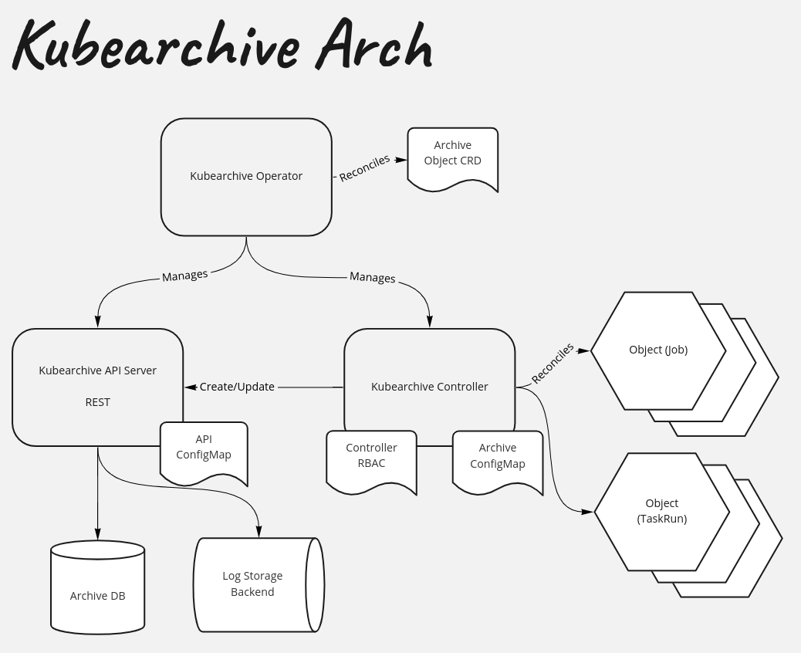

# Kubearchive Architecture

Kubearchive consists of the following components:

- A database
- A log storage backend
- A controller (manager) that reads data from the cluster
- A REST API server that facilitates the storage and retrieval of cluster data
- (future) An Operator that manages the configuration and deployment of the above components

## Database Model

See the [database model](database.md) for a full reference.