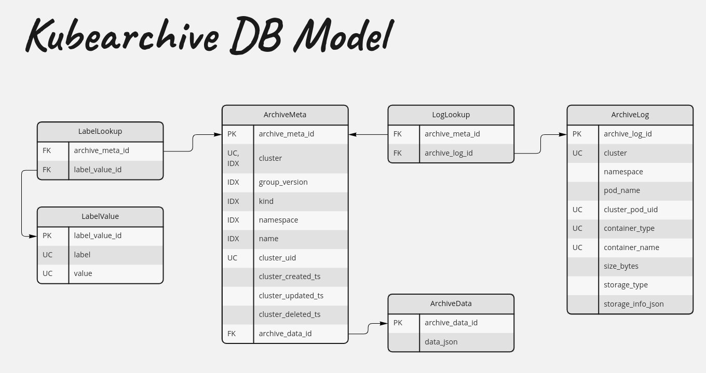

# Kubearchive Database Model

The database model consists of the following tables:

## ArchiveMeta

This holds the metadata for the archived object.

| Key/Index | Column Name | Column Type |
| --------- | ----------- | ----------- |
| PK | archive_meta_id | UUID |
| FK | archive_data_id | UUID |
| IDX, UC | cluster | string |
| IDX | group_version | string |
| IDX | kind | string |
| IDX | namespace | string |
| IDX | name | string |
| UC | cluster_uid | string |
| | cluster_created_ts | timestamp |
| | cluster_updated_ts | timestamp |
| | cluster_deleted_ts | timestamp |

## ArchiveData

This holds the raw JSON data of the archived object.

| Key/Index | Column Name | Column Type |
| --------- | ----------- | ----------- |
| PK | archive_data_id | UUID |
| | data_json | binary* |

*Note: binary data may be optimizable depending on the database engine.

## LabelLookup

This is a lookup table for the many/many relationship between labels (key/value pairs) and archived objects.

| Key/Index | Column Name | Column Type |
| --------- | ----------- | ----------- |
| FK, UC | archive_meta_id | UUID |
| FK, UC | label_value_id | UUID |

## LabelValue

This holds the unique key/value pairs for labels within kubearchive.
The intent is to facilitate querying by label (keys or keys + values).

| Key/Index | Column Name | Column Type |
| --------- | ----------- | ----------- |
| PK | label_value_id | UUID |
| IDX | label_key | string |
| IDX | label_value | string |

## ArchiveLog

ArchiveLog represents the logs of a container within pod.
Containers are uniquely identified by the pod's UID, the type of container (currently `Init`, `Application`, and `Ephemeral`), and container name.

| Key/Index | Column Name | Column Type |
| --------- | ----------- | ----------- |
| PK | archive_log_id | UUID |
| UC | cluster | string |
| IDX | namespace | string |
| IDX | pod_name | string |
| UC | pod_uid | string |
| UC | container_type | string |
| UC | container_name | string |
| | size_bytes | int64 |
